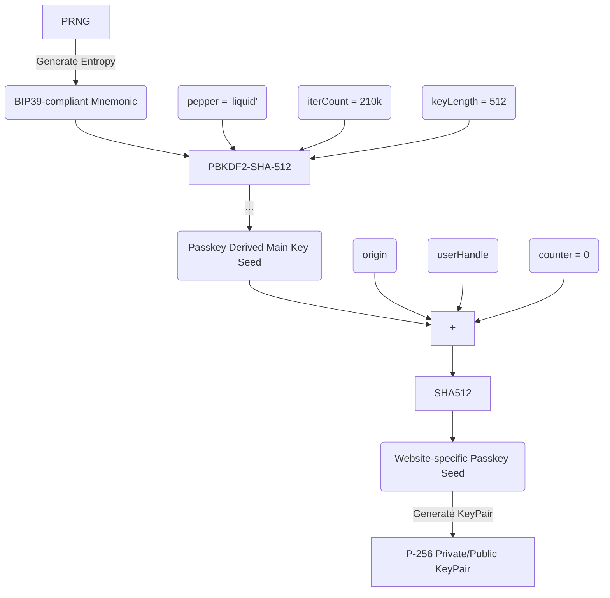

# DeterministicP256 (Swift) - Deterministically generate P-256 (Secp256r1) credentials

A small library created for Liquid Auth allowing users to specify a BIP39-compliant mnemonic, ran through a PBKDF2, to produce a derived main key that can then be used to generate other passkeys for FIDO2-based web authentication.

This allows a user to regenerate passkeys created for specific domains (e.g., GitHub.com) and userHandles anew, across platforms and devices. The alternative is to either keep the passkeys device-bound, or to rely on Google or Apple to custody the keys on-behalf of the user.

# Disclaimer

Deterministically generating passkeys allow for a user to regenerate their exact same passkeys anew should their device be wiped, destroyed or lost. This is _really_ useful, but it requires the user to manage and properly store a long mnemonic phrase (24 words).

Should the user's mnemonic leak, anyone with knowledge of their userHandles will be able to deterministically re-generate **_ALL_** their passkeys and access their accounts. This would be catastrophic.

# Flow

1. Generating the Mnemonic

The first step is to acquire a BIP39 valid mnemonic phrase. The entropy behind it should have been generated using a secure PRNG function.

This is not handled by this library.

2. Transforming the BIP39 mnemonic into a P-256 derived main key

The BIP39 mnemonic serves as a "passphrase" for our PBKDF2-SHA-512 key derivation function. The function also takes a "salt", an iteration count and a key length.

- To ensure determinism, and to avoid the user having to manually keep track of additional secrets per origin service, an application-wide "pepper" value can be passed instead. By default, that pepper is "liquid".

- Iteration count () is set at 210 000 by default.

- Key length is set at 512 by default.

Note: setting the "salt" value to "mnemonic" and iteration count to 2048 will replicate the normal [BIP39 seed generation procedure](https://github.com/bitcoin/bips/blob/master/bip-0039.mediawiki#from-mnemonic-to-seed) and is **_NOT RECOMMENDED_**. It would mean that the output seed would be equivalent to the user's crypto wallet seed, and that the blast radius of the output seed being leaked would extend beyond an adversary gaining access to the user's authentication P-256 passkeys but also to the adversary having control of the user's crypto assets.

We are purposefully creating a barrier. An app consuming this library only needs to store the P-256 seed, it does not need to store the mnemonic as well - though it might choose to do so to ensure the user has a way to write down their mnemonic again if they lost their "paper backup".

The point is that while the mnemonic chould be inputted - and thus be loaded into memory - only once in the lifetime of the device (or until it gets wiped), the P-256 derived main key needs to be loaded into memory from secure storage any time the user needs to generate a new passkey keypair for a new website.

The P-256 derived main key secret is used to generate keypairs, which are unique per origin service and userHandle and which are loaded into memory every time the user needs to sign with them (sign into a website).

3.  Generating a Passkey (P-256 keypair) from the P-256 derived main key

To generate a new keypair for a website, the P-256 derived main key is concatenated alongside the origin domain identifier (e.g., the URL) and the userHandle. A counter can also optionally be specified - if not, by default, it is set as 0.

Picking the URL is useful as it prevents phishing attacks - a slight deviation in the URL results in a totally different keypair. But it also means that a change of the URL (e.g. Twitter -> X) results in having to generate new keypairs.

The concatenation is passed through SHA-512, producing a new website-specific seed. This seed is then used to generate a P-256 passkey keypair. The public key is registered with the service in question and normal FIDO2/WebAuthn flows for sign in can be performed.

## Diagram

Putting it all together:



```swift

let DP256 = DeterministicP256()

// Generate the derived main key by passing along a BIP39 mnemonic:

let derivedMainKey = try D.genDerivedMainKeyWithBIP39(
            phrase: "salon zoo engage submit smile frost later decide wing sight chaos renew lizard rely canal coral scene hobby scare step bus leaf tobacco slice"
        )
```

The function `genDerivedMainKeyWithBIP39(.)` validates the mnemonic, that the words are 1) valid according to the [wordlist](https://github.com/bitcoin/bips/blob/master/bip-0039/bip-0039-wordlists.md). 2) that the checksum (final word) is correct.

It wraps around the private function `genDerivedMainKey` which in turn calls PBKDF2-HMAC-SHA512. By default, the salt is `liquid`(in bytes), iterator count is 210_00 and key length 512 (64 bytes).

A `derivedMainKey`is returned from this function. In the context of generating P-256 passkeys, the mnemonic should be safely stored off-device and never stored on it; a user can supply it if needed (e.g., if the device's storage gets wiped). It is enough to store the derivedMainKey.

A domain (website) and user-specific P-256 keyPair can now be generate, for use in a FIDO2-compliant passkey sign-in flow.

```swift
// Example values taken from: https://webauthn.guide/#registration
let origin = "https://webauthn.guide"
let userHandle = "a2bd8bf7-2145-4a5a-910f-8fdc9ef421d3"

let keyPair = DP256.genDomainSpecificKeyPair(derivedMainKey, origin, userHandle)
```

Note that what we call a keyPair is actually a `P256.SigningKey.PrivateKey` ([Apple docs](https://developer.apple.com/documentation/cryptokit/p256/signing/privatekey)) but we call it keyPair because it can produce its own PublicKey.

Optionally, `genDomainSpecificKeypair()` also takes a counter Int value (by default it is counter = 0). This allows for multiple passkeys to be generated for a specific domain and userHandle, by incrementing the counter.

Under the hood, the seed for the keyPair is generated by computing `SHA512(derivedMainKey || origin || userHandle)` where || refers to a concatenation of the bytes.

To sign with a keypair:

```swift
let message = "Hello, World!".data(using: .utf8)!
let signature = try D.signWithDomainSpecificKeyPair(
    keyPair: keyPair,
    payload: message
)
```

and to validate it:

```swift
let isValidSignature = keyPair.publicKey.isValidSignature(
    signature,
    for: message
)
XCTAssertTrue(isValidSignature, "Signature should be valid!")
```

For FIDO2/WebAuthn, it is useful to be able to deterministically produce the Credential Id,
e.g. by calculating the SHA256 hash of the public key. To ensure determinism and equivalence
with the Kotlin library, the getPurePKBytes method has been made available:

```swift
import CryptoKit

let pk = D.getPurePKBytes(keyPair: keyPair)
let hash = SHA256.hash(data: D.getPurePKBytes(keyPair: keyPair))
            .withUnsafeBytes { Array($0) }
```

The hash digest should be exact same as produced with the Kotlin library.

# Setup

This library relies on Swift 5.9, uses Swift Package Manager and comes with a pre-commit hook.

Copy the hooks under git-hooks into the .git/hooks/ directory:

```bash
chmod +x git-hooks/pre-commit
cp git-hooks/* .git/hooks/
```

# LICENSE

Copyright 2024 Algorand Foundation

Licensed under the Apache License, Version 2.0 (the "License");
you may not use this file except in compliance with the License.
You may obtain a copy of the License at

    http://www.apache.org/licenses/LICENSE-2.0

Unless required by applicable law or agreed to in writing, software
distributed under the License is distributed on an "AS IS" BASIS,
WITHOUT WARRANTIES OR CONDITIONS OF ANY KIND, either express or implied.
See the License for the specific language governing permissions and
limitations under the License.
